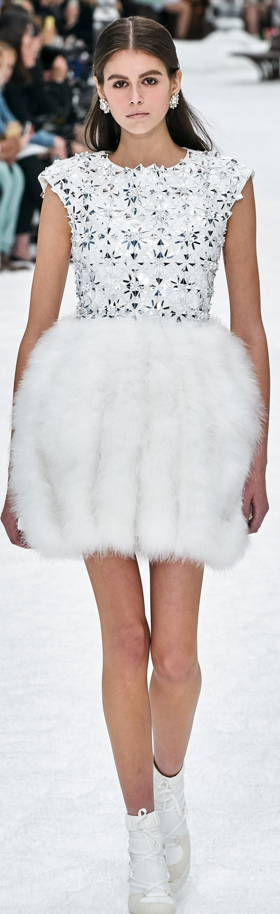
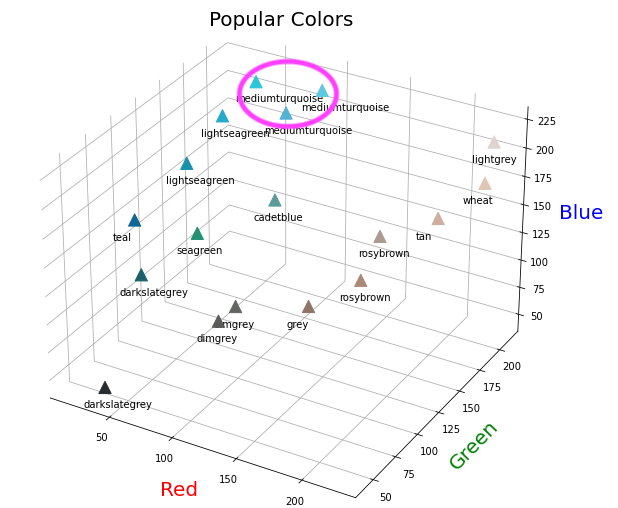
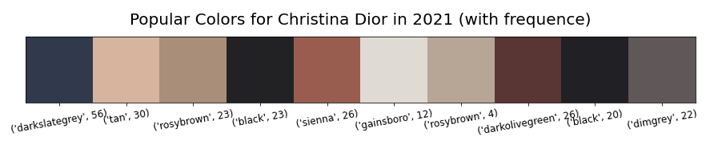
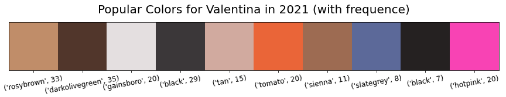

# Fashion Colors Prediction

Letty Wu

## Problem Statement

The United States apparel market was valued at approximately 368 billion US dollars as of 2019. Top clothing companies lead the global fashion industry, fast fashion and smaller brands usually follow the style and color trends from those high-end brands, and they use data to predict the rise and fall of trends. Fashion show is one of the way leading brand showcase their new products, therefore fashion show pictures is a good way to predict the upcoming trends. 

## Data Collection

Vogue is an American monthly fashion and lifestyle magazine covering many topics, including fashion, beauty, culture, living and runway. Vogue Runway has up-to the minute fashion show coverage at New York, London, Milan and Paris Fashion Weeks, including photos, videos, reviews. Many Fashion houses used to create eight collections a year. The new shift in fashion is to two collections a year: spring/summer and fall/winter. The simplified approach puts customers at the center by creating pieces when people will actually be shopping for them.

So I scraped my image data from Vogue runway, 50 leading brands with fall and spring season in 2021, I ended up collected around 2,000 fashion show pictures. While scraping, I annotated the file name with brand name, year, season and picture id for each image.

## Preprocessing

First, I used YOLO v5 to conduct the object detection. YOLO v5 is a family of compound-scaled object detection models trained on the COCO dataset. YOLO stands for *you only look once*,  it’s a convolutional networks. YOLO originally come out around 2016 and YOLO v5 come out in July 2020, it’s know for its speed and easy to use. 

    
    
Second, I cropped the model along out of the original pictures, the approach is saving the biggest object YOLO detected, which in this case, it’s always the model.

    
    
Third, I removed the background using [rembg](https://github.com/danielgatis/rembg) package, by doing this, I transferred the background into transparent. 

    

Finally, I used Pillow library to resize all the pictures to save some computation power.

    

## Modeling
    
After done with the processing, I extract the domain colors with their RGBA value from each image and put them into a data frame. I also tried hex color system, hex color system is a hexadecimal way to represent a color in RGB format by combining three values, however hex color system didn’t perform well when I use Kmeans Clustering, so I ended up using RGBA value. 

<h4>
Sample of dataframe
</h4>

|**brand**|**year**|**season**|**num**|**r**|**g**|**b**|**a**|
|-|-|-|-|-|-|-|-|
|chanel|2021|spring|48|206|167|150|253|
|chanel|2021|spring|48|17|25|33|253|
|chanel|2021|spring|48|178|136|120|253|
|koche|2021|spring|35|27|23|30|253|
|dsquared|2021|fall|4|104|95|95|249|
|burberry-prosum|2021|spring|42|89|89|92|253|
|christian-dior|2021|spring|35|205|180|159|253|

## Insights

  
   

    

This is a demonstration of the popular color from on model, at very top, all the 3 blueish color they have same name, but from RGB value, we can tell they are clearly different colors. So, it’s valuable to use Kmeans Clustering to get the accurate color, instead of arbitrary group by the color name, I believe this matter for industry expertise.  

    
    
Those are predicted popular colors in 2021, but it’s a quick and dirty way to predict the popular colors, because it only contains 50 brands. 

  
  
  

  
  
  

    

We can also predict the popular colors for different brands, each brand usually has their own favorite colors for the season. 

## What's next

-Exclude models’ skin color out of the domain colors. Maybe train my own YOLO model and make it predict the clothing only. 

-Image data are huge, I would like to use more than 50 brands to predict the colors, maybe this problem can be solved by using Google Cloud Platform. 

-Make an app using Streamlit.

